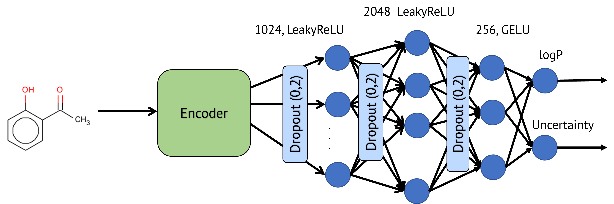

# GRAPH-BASED TRANSFORMER TO PREDICT THE OCTANOL-WATER PARTITION COEFFICIENT 

Lipophilicity is a fundamental physicochemical property that significantly influences various aspects of drug behavior, such as solubility, permeability, metabolism, distribution, protein binding, and excretion. Consequently, accurate prediction of this property is critical for the successful discovery and development of new drug candidates. The classical metric for assessing lipophilicity is logP, defined as the partition coefficient between n-octanol and water at physiological pH 7.4. Recently, graph-based deep learning methods have gained considerable attention and demonstrated strong performance across diverse drug discovery tasks, from molecular property prediction to virtual screening. These models learn informative representations directly from molecular graphs in an end-to-end manner, without the need for handcrafted descriptors. In this work, we propose a logP prediction approach based on a fine-tuned pre-trained GraphormerMapper model, named GraphormerLogP. To evaluate its performance, the model was tested on two datasets: one is compiled by us from publicly available sources and contains 42 006 unique SMILES-logP pairs (named GLP); the second consists of 13 688 molecules and is used for benchmarking purposes. Our comparative analysis against state-of-the-art models (Random Forest, Chemprop, StructGNN, and Attentive FP) demonstrates that GraphormerLogP consistently achieves superior predictive accuracy, with average mean absolute error values of 0.251 and 0.269 on the two datasets, respectively. 

The following datasets have been used: 

| Dataset name | Number of Samples | Description | Sources |
| --- | --- | --- | --- |
| SGNN_dataset | 13688 | logP datasets from article http://arxiv.org/abs/2011.12117. The ratio of training, validation and test subsets is 70:15:15 | http://arxiv.org/abs/2011.12117 |
| GLP_dataset | 42006 | Concatenated by processing data from articles. The ratio of training, validation and test subsets is 70:15:15. | https://link.springer.com/article/10.1007/s10822-021-00400-x, https://pubs.acs.org/doi/full/10.1021/acsomega.2c05607#eq1, https://www.nature.com/articles/s42004-021-00528-9 |

## Paper

For a detailed description of GraphormerLogP we refer the reader to the paper ["GRAPH-BASED Transformer to Predict the octanol-water partition coefficient "]('https').

## Components

- data/clean_data - datasets that went through the cleaning algorithm, but were not yet divided into subsets
- data/raw_data - сontains raw data sets from articles
- data/data_preprocessing - contains the following scripts:
    - preprocess_dataset.py - the use of the data cleansing algorithm to data from the folder raw_data, the results should be saved to the clean_data
    - separate_data.py - separation of the dataset from the folder clean_data into training, validation, test subsets, the results should be saved to the separate_data
    - checkers.py - auxiliary file of the cleaning algorithm
- GraphormerLogP/GLP_dataset - contains GraphormerLogP models trained on the GLP_dataset
- GraphormerLogP/SGNN_dataset - contains GraphormerLogP models trained on the SGNN_dataset
- Random_forest/rdkit/GLP_dataset - contains random forest models trained on the GLP_dataset using RDKit descriptors
- Random_forest/rdkit/SGNN_dataset - contains random forest models trained on the SGNN_dataset using RDKit descriptors
- data/separate_data - prepared datasets divided into training, validation and test subsets
- Baselines/AttentiveFP - сontains predictions of the AttentiveFP model trained on the GLP_dataset
- Baselines/D_MPNN - сontains predictions of the D_MPNN model trained on the GLP_dataset
- Baselines/StructGNN - сontains predictions of the StructGNN model trained on the GLP_dataset

## GraphormerLogP

### Dependencies

Only python 3.10 or 3.11

- cgrtools = 4.0.41
- chython = 1.75
- chytorch = 1.62
- chytorch-rxnmap = 1.4
- click = 8.1.7
- joblib = 1.4.2
- loguru = 0.7.3
- lxml = 4.9.4
- markupsafe = 2.1.5
- matplotlib = 3.9.0
- networkx = 3.2.1
- numpy = 1.26.4
- openpyxl = 3.1.5
- pandas = 2.2.1
- pillow = 10.3.0
- pmapper = 1.1.3
- pytorch-lightning = 2.2.1
- rdkit = 2023.9.5
- scikit-learn = 1.3.0
- scipy = 1.12.0
- seaborn = 0.13.2
- sympy = 1.12
- torch = 2.0.0
- torchmetrics = 1.3.2
- torchtyping = 0.1.4
- tqdm = 4.66.2

### Training

1. `poetry install`
2. `cd GraphormerLogP/GLP_dataset`
3. `python __main__.py -d GLP_dataset.csv -i interm`

## Baselines

### DMPNN

Article - [Analyzing Learned Molecular Representations for Property Prediction](https://pubs.acs.org/doi/10.1021/acs.jcim.9b00237)

Original Github Repo - https://github.com/chemprop/chemprop

#### Dependencies

- chemprop==1.4.1
- click==8.1.7
- joblib==1.4.2
- matplotlib==3.7.5
- numpy==1.21.0
- pandas==2.0.3
- pandas-flavor==0.6.0
- pillow==10.3.0
- rdkit==2023.9.6
- rsa==4.9
- scikit-learn==1.2.2
- scipy==1.10.1
- sympy==1.12
- torch==2.4.1
- torchaudio==2.4.1
- torchvision==0.19.1

### StructGNN

Article - [Lipophilicity Prediction with Multitask Learning and Molecular Substructures Representation](https://arxiv.org/abs/2011.12117)

Original Github Repo - https://github.com/jbr-ai-labs/lipophilicity-prediction

#### Dependencies

  - python>=3.6
  - flask>=1.1.2
  - gunicorn>=20.0.4
  - hyperopt>=0.2.3
  - matplotlib>=3.1.3
  - numpy>=1.18.1
  - pandas>=1.0.3
  - pandas-flavor>=0.2.0
  - pip>=20.0.2
  - pytorch>=1.4.0
  - rdkit>=2020.03.1.0
  - scikit-learn>=0.22.2.post1
  - scipy>=1.4.1
  - tensorboardX>=2.0
  - torchvision>=0.5.0
  - tqdm>=4.45.0

### AttentiveFP

Article - [Pushing the Boundaries of Molecular Representation for Drug Discovery with the Graph Attention Mechanism](https://pubmed.ncbi.nlm.nih.gov/31408336/)

Original Github Repo - https://github.com/OpenDrugAI/AttentiveFP

#### Dependencies

- matplotlib==3.0.3
- numpy==1.21.6
- pandas==0.24.0
- Pillow==9.5.0
- pyparsing==3.1.2
- pytz==2024.1
- rdkit==2022.3.3
- scikit-learn==0.20.3
- scipy==1.2.1
- seaborn==0.9.0
- torch==1.13
- typing_extensions==4.7.1

## Citation
@Article{
  title={GRAPH-BASED TRANSFORMER TO PREDICT THE OCTANOL-WATER PARTITION COEFFICIENT},
  author={Grigorev V., Serov N., Gimadiev T., Poyezzhayeva A., Sidorov P.},
}exa

